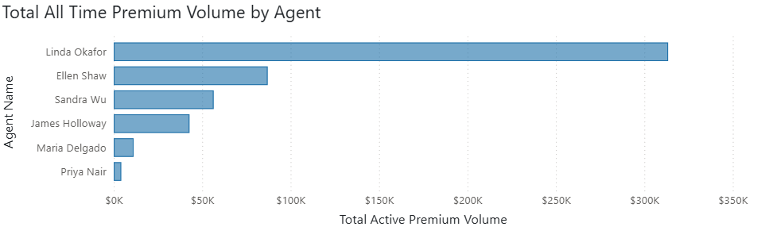
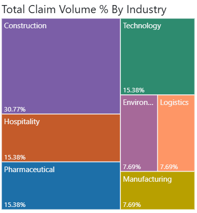

## Vantage Client Analysis
Agent Performance, Claims Analysis, and Premium Reconciliation in a Commercial Lines Insurance Context

## Executive Summary

Vantage Insurance is a small commercial insurance broker that focuses on property and casualty lines across multiple industries. Data reporting and collection is only contained in spreadsheets as are monthly and ad hoc reports. This report outlines the launch of a new manager oversight and reporting program aimed at increasing revenue and reducing risk exposure within our mid-market accounts. The goal is to align sales and underwriting teams more strategically around the acquisition of new business and reevaluate the risk profile of existing accounts. Vantage Insurance struggles with a lack of data infrastructure and reporting that leads to significant losses in premiums and outsized risk exposure, making Vantage unprofitable.

### Key Findings
+ The loss ratio for Vantage Insurance is 182 across all active policies
+ Total active premium value is $515K across all existing accounts
+ Cyber Liability has a loss ratio that is 316% higher than the next policy type, which will require an expansion in underwriting teams for that policy type


### Key Visuals

Total Premium Volume By Agent


Total Claims Volume As a Percentage By Industry

### Key Questions
+ Where do agent strengths lie across industry, clients, and premium spend?
+ How does loss ratio vary across industry and agent?
+ Which clients have fallen behind on premium payments?


## Findings

Loss ratios among agents vary widely, but the most notable is Linda Okafor's total loss ratio across all clients at 273.45. This is far above the ideal profitable loss ratio of under-60 and is considered unacceptable. This figure represents significantly outsized claims exposure, which should lead to a significant increase in premiums for Coastal Pharmaceuticals and Summit Tech Group. Other notable agents include James Holloway, who has a loss ratio of 95.06, which is unacceptable, and Priya Nair at 73.81, which warrants manager review.

Expanding on claims, Linda Okafor’s largest account, Coastal Pharmaceuticals, two large Cyber Breach claims have caused a combined loss of $715,000 against a total premium of $304,500. There is an obvious lack of underwriting analysis on Coastal Pharmaceuticals, which can be corrected by further collaboration between underwriters and investigators.

Bluewater Marine has been a client for the third longest period of any client, yet carries a low premium spend of $18,750. This is an upsell opportunity. The Northeast region has the highest premium volume overall, though Coastal Pharma accounts for 74% of that figure. Coastal Pharma holds General Liability and Cyber Liability policies. Given their spend, Linda Okafor has a clear opportunity to add additional Property and Casualty coverage pending underwriter review.

The average time between the date of loss and the incident report is under eight days for all claim types except cyber breaches, which average 11.5 days. Cyber breaches also represent the greatest total loss. It is worth asking whether the longer reporting window affects payout amounts.

Three policy types have paid out claims. Cyber Liability is the largest by far at $715,000. Workers' Compensation and General Liability have the second and third-highest average claim payouts.  Construction companies account for 36% of total claims by volume.

Finally, revenue leakage exists in two clients, Apex Roofing Inc and Bluewater Marine due to an outstanding premium balance of $33,350. This balance amounts to 6.5% of the total of all premium value, a significant loss which stemmed from a missing record connecting two tables. A dashboard metric tracking outstanding balances will be added to the new reporting program in order to reduce said losses.

## Approach

### Dataset
+ Source: Vantage Commercial Insurance
+ Size: 5 tables, 10 to 15 rows each
+ Key tables: agents, claims, clients, policies, premium_payments

The key business questions are stored in [Key Business Questions SQL](vantage_key_business_q.sql) and the initial data cleaning is stored in a separate file [Vantage Data Clean SQL](vantage_data_clean.sql).

### SQL Techniques Used
```JOINs, CTEs, Window Functions, COALESCE, ABS, ROW NUMBER, IS NOT NULL```

### Business Context
My interest in commercial insurance and its relationship with the broader economy led me to build this project. Volatile market conditions make internal data processes more important than ever for firms like Vantage. I asked Claude.ai to generate a five-table schema for agents, claims, clients, policies, and premium payments. Each table was seeded with messy and inconsistent data, including formatting errors, missing values, and misspelled names. This reflects a real problem many small firms face when integrating legacy systems or working without a formal data framework.

## Query Development
### Client and Agent Overview

+ Q1 required multiple aggregates and two joins given the scope of the question. It surfaced the finding that more than one agent carried a concerningly low premium volume.
+ Q2 started with a single join to find which clients had been with Vantage the longest, then followed up with a query on premium volume for those same clients. Those long tenured clients had average premium volume, which flagged an upsell opportunity.
+ Q3 combined client and agent data to find the highest value client and their assigned agent. This exposed a gap in my initial data cleaning. Coastal Pharma, the largest client, had no assigned agent. Their previous agent had left the firm. In a real company, this gap could create serious problems for client retention and billing.
+ Q4 used multiple joins and a single aggregate to find total premium volume by region.
+ Q5 used a COUNT function to find how many clients each agent has per industry.
+ Q6 asked for the loss ratio and three responses to a column which flags loss ratio as Acceptable, Manager Review, or Unacceptable. I used a CTE to define the agents and loss ratio to reduce the need in the main query to restate the loss ratio when comparing it to the parameters for loss ratio flagging.

### Claims

+ Q7 required a COALESCE function wrapped around the SUM to clean up messy display values for total claim payout.
+ Q9 took multiple rounds of testing. My first attempt used AVERAGE and ROUND to find the average time between date of loss and date of reporting, but it returned a negative value. I added the ABS function to return a readable positive value.
+ Q10 produced results that included the Property policy type, which had no associated claims. An IS NOT NULL clause in the WHERE filter removed it.
+ Q11 required a window function to calculate the percentage of total claims by volume for the construction industry only. My first attempt multiplied the fraction by 100.0 outside the initial division, which skewed the results. Moving that multiplication inside the first COUNT statement fixed it.

### Payments and Premiums

+ Q12 and Q13 both filter for unpaid and partial premium payments using the same WHERE clause. I avoided IFNULL to make sure zeroed values were not pulled into the results.

### Data Quality

+ Q16 used multiple COALESCE functions to flag and replace missing contact details with placeholder strings, which were then backfilled using UPDATE statements.
+ Q17 addressed duplicate claims across three columns using a ROW NUMBER window function to rank duplicates in order. An outer query selected any row ranked beyond the first, and I deleted those rows using the ctid.


## Challenges
The biggest technical challenge was Q8. Returning a negative average time between two dates was unexpected and required me to rethink how PostgreSQL handles date arithmetic. Adding ABS solved it, but it also prompted me to go back and validate my date columns more carefully across the whole dataset.

Finding the missing agent assignment for Coastal Pharma in Q3 was also a major find as it heavily skewed results. It was not a query I planned to write. It came up naturally while checking my results, which is a good reminder that data cleaning is not a one time step.

In Q6, it should be noted that a CURRENT_SETTING() function would be necessary in a production setting as the parameters for flagging would need to be dynamic between changing market conditions as well as the policy type.


[def]: Images/claim_volume_by_industry.png